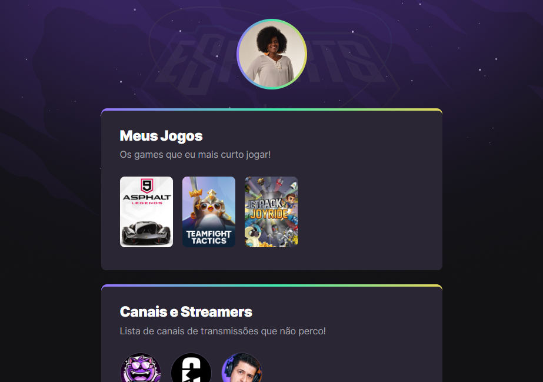

# Olá, mundo! 👋

Me chamo Adriele, estou participando do evento NLW e-Sports #9 da RocketSeat. Dentro desse evento fiz trilha explorer, que é para quem está começando. 

A ideia do projeto foi construir um agregador de links para um site de jogos!

## Tecnologias utilizadas no projeto:
- HTML
- CSS
- GIT

Espero que gostem.

[Acesse o projeto aqui](https://adriele1996.github.io/NLW-e-Sports/)

## Contato

machado.adriele96@gmail.com